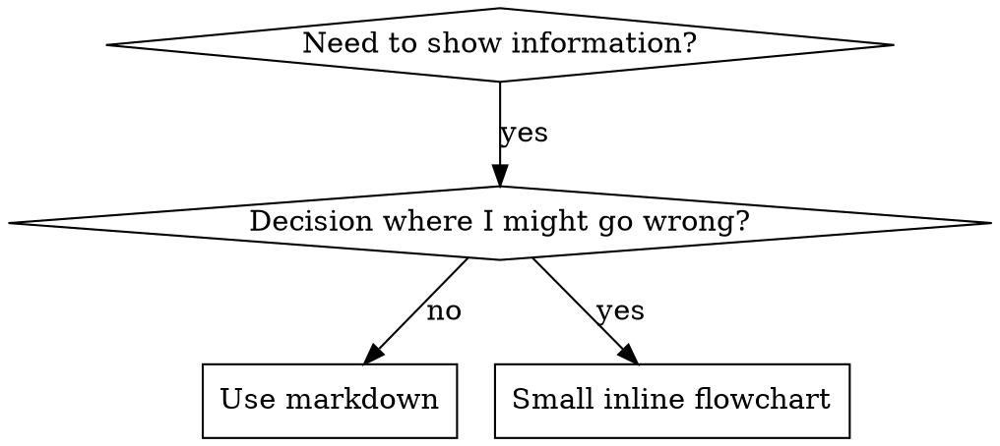

# Writing Skills: flowcharts

The decision graph and rendering notes from Flowchart Usage, moved here from [SKILL.md](SKILL.md) to keep the skill body under the
20,000-character re-attach cap.



**Visualizing for your human partner:** Use `render-graphs.js` in this directory to render a skill's flowcharts to SVG:
```bash
node ./render-graphs.js ../some-skill           # Each diagram separately
node ./render-graphs.js ../some-skill --combine # All diagrams in one SVG
```
